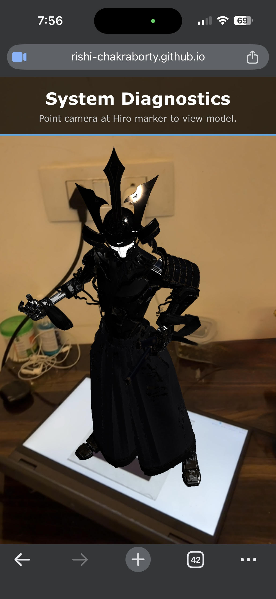

# 🌐 Enterprise AR Diagnostics Dashboard

An interactive Web Augmented Reality (WebAR) prototype that overlays real-time, simulated diagnostic data onto a physical 3D asset. Built for the browser, this project demonstrates how AR can be used in enterprise settings for server maintenance, machinery inspection, and remote troubleshooting.

 
*(Note: Replace `demo-screenshot.png` with an actual screenshot of your project running!)*

## ✨ Features
* **Marker-Based AR:** Utilizes AR.js to anchor a high-fidelity 3D model (GLB format) to a standard Hiro marker.
* **Interactive 3D Elements:** Includes an event-listener system that detects user taps/clicks on the 3D model through the device screen.
* **Dynamic UI Overlay:** A responsive 2D HTML/CSS dashboard that slides into view upon interaction, displaying context-aware data (Uptime, Core Temp, Power Efficiency).
* **Physically Based Rendering (PBR):** Custom ambient and directional lighting setup in A-Frame to properly render metallic textures and model depth.

## 🛠️ Tech Stack
* **Framework:** [A-Frame](https://aframe.io/) (WebVR/XR entity-component framework)
* **AR Tracking:** [AR.js](https://ar-js-org.github.io/AR.js-Docs/) (Lightweight marker tracking)
* **Languages:** HTML5, CSS3, Vanilla JavaScript
* **3D Assets:** `.glb` (GL Transmission Format)
* **Deployment:** GitHub Pages

## 🚀 Live Demo
You can try the project right now in your web browser! No app download required.

1. Open this Hiro Marker on your computer screen (or print it out): [Hiro Marker Image](https://raw.githubusercontent.com/AR-js-org/AR.js/master/data/images/hiro.png)
2. Open the Live Demo link on your smartphone: https://rishi-chakraborty.github.io/ar-demo/
3. Grant camera permissions when prompted.
4. Point your phone at the Hiro marker on your screen.
5. Tap the 3D model to reveal the diagnostic dashboard!

## 💻 Local Installation
If you would like to run this project locally or modify the code:

1. Clone this repository:
   
        git clone [https://github.com/Rishi-Chakraborty/ar-demo.git](https://github.com/Rishi-Chakraborty/ar-demo.git)
   
2. Navigate to the project directory:

        cd ar-demo
   
3.Start a local server. Because A-Frame requires a server environment to load external 3D models and handle CORS, you cannot simply double-click the index.html file.

    Using VS Code: Install the "Live Server" extension and click "Go Live".

    Using Python: Run python -m http.server 8000 in your terminal and visit http://localhost:8000.

🧠 What I Learned
Building this project taught me how to bridge the gap between 2D web UI and 3D spatial computing. I learned how to manage 3D assets in a browser environment, configure virtual lighting for PBR materials, and use raycasting to allow users to interact with virtual objects using standard touch events.

Designed and built by Rishi Chakraborty
